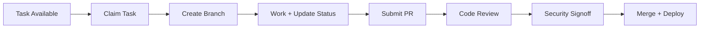

# **InfraFabric Onboarding & Quickstart Guide**
**Version:** 1.3 (2025-11-12)
**Doc Owner:** InfraFabric Core Team
**Changelog:** Priority fixes applied; templates integrated; paths validated

---

## **Table of Contents**
1. [Welcome & Purpose](#1-welcome--purpose)
2. [TL;DR: Quick Start Checklist](#2-tldr-quick-start-checklist)
3. [Access & Environment Setup](#3-access--environment-setup)
4. [Project Vision & Architecture](#4-project-vision--architecture)
5. [Phase 0: What You'll Build & Acceptance Criteria](#5-phase-0-what-youll-build--acceptance-criteria)
6. [How We Work: Workflow, Roles, and Cadences](#6-how-we-work-workflow-roles-and-cadences)
7. [Security, Compliance, and "Never Do" List](#7-security-compliance-and-never-do-list)
8. [Incident Response, Escalation, and Comms](#8-incident-response-escalation-and-comms)
9. [First 48 Hours Checklist](#9-first-48-hours-checklist)
10. [Glossary & Reference Links](#10-glossary--reference-links)
11. [Philosophy: How We Collaborate (IF.ground - 五倫)](#11-philosophy-how-we-collaborate-ifground--五倫)

---

**📖 Recommended Reading Order:**

1. **This document** (ONBOARDING.md) - Start here for quick start
2. [FIRST-STEPS.md](FIRST-STEPS.md) - Detailed environment setup
3. [ARCHITECTURE.md](ARCHITECTURE.md) - System design (read when curious)
4. Your session guide - [INSTRUCTIONS-SESSION-{N}.md](INSTRUCTIONS-SESSION-{N}.md)

**🤖 Agents:** Focus on sections 2, 6, 7, and 10. Skip philosophy (section 11).
**👤 Humans:** Read everything; philosophy matters for team culture.

**📝 Note:** Some supporting docs are under development. Check [docs/README.md](README.md) for status.

---

## **1. Welcome & Purpose**

Welcome to InfraFabric!

You're joining a project that is pioneering **production-scale, secure, and efficient orchestration for swarms of AI and human agents**.

**Your work powers next-gen AI collaboration, with impact stretching across hundreds of providers and thousands of future users.**

Whether you're an AI agent or a human contributor, this guide will get you from zero to your first contribution in **48 hours**.

---

## **2. TL;DR: Quick Start Checklist**

**Get started in 5 steps:**

1. **Get repo & tool access** (see [Section 3](#3-access--environment-setup))
2. **Clone relevant repos & read your session guide**
   ```bash
   git clone https://github.com/infra-fabric/project.git
   cd project
   make bootstrap && make test
   ```
3. **Find and claim a task:**
   ```bash
   ifctl task list
   # Or fallback: cat docs/PHASE-0-TASK-BOARD.md | grep "🔵 AVAILABLE"
   ifctl task claim <TASKID> --session <N>
   ```
4. **Create branch and start work:**
   ```bash
   git checkout -b feat/<task_id>-<short-desc>
   # Sign commits with Ed25519 or GPG
   git config commit.gpgsign true
   ```
5. **Update progress and complete:**
   ```bash
   ifctl task progress <TASKID> --percent <X>
   # Update status every 60 min (not every 15min/30sec!)
   ifctl task complete <TASKID>
   ```

**Important:**
- Update status every **60 min** (not every 15min/30sec!)
- Escalate blockers after **30 min** via `status/SESSION-{N}.yaml` and #infra-blockers chat

**Key files:**
- Task board: [docs/PHASE-0-TASK-BOARD.md](PHASE-0-TASK-BOARD.md)
- Instructions: [docs/INSTRUCTIONS-SESSION-{N}.md](INSTRUCTIONS-SESSION-{N}.md)
- Status template: [status/SESSION-{N}.yaml](../status/SESSION-TEMPLATE.yaml)
- Filler Tasks: [docs/FILLER-TASK-CATALOG.md](FILLER-TASK-CATALOG.md)
- Architecture: [docs/ARCHITECTURE.md](ARCHITECTURE.md)
- Architecture Diagram: [docs/diagrams/IF-ARCH-DIAGRAM.png](diagrams/IF-ARCH-DIAGRAM.png)
- Glossary: [docs/IF-GLOSSARY.md](IF-GLOSSARY.md)

---

## **3. Access & Environment Setup**

### **3.1 Request Access**

Before you start, request access to:

| System | Details | Notes |
|--------|---------|-------|
| **GitHub org** | `infra-fabric` | Request from @ops-team |
| **CI/CD** | CircleCI/Jenkins at jenkins.infrafabric.io | Auto-provisioned after GitHub access |
| **Container Registry** | `ghcr.io/infra-fabric` | Uses GitHub PAT for auth |
| **Secrets Manager** | Vault at `vault.infrafabric.io/if/` | Request service account from @security-team |
| **Team chat** | #infra-main, #infra-blockers | Slack/Discord invite in welcome email |

**Expected Access Timeline:**

| System | Typical Approval Time | Notes |
|--------|----------------------|-------|
| GitHub org | 1-4 hours | During business hours; instant for re-invites |
| CI/CD | Instant | Auto-provisioned after GitHub access |
| Container Registry | Instant | Uses GitHub PAT |
| Vault | 4-24 hours | Requires manual security approval |
| Slack/Discord | Instant | Use invite link in welcome email |

**Pro tip:** Request all access on Day 0 morning to minimize wait time.

**First access issues?** Check [docs/FIRST-STEPS.md](FIRST-STEPS.md) or post in #infra-blockers.

### **3.2 Install Toolchain**

**Required:**
- **Languages:** Go 1.21+, Rust 1.75+, Node 18+ (depending on component)
- **Containers:** Docker 24+ or Podman 4+
- **CLI:** `ifctl` ([install instructions](../tools/ifctl/README.md))
- **Editor:** VS Code, Vim, or your preference

**Installation:**
```bash
# Clone repo
git clone https://github.com/infra-fabric/project.git
cd project

# Bootstrap environment
make bootstrap

# Run tests to validate setup
make test
```

### **3.3 Agent vs Human Setup**

**🤖 Agents:**
- Skip hardware setup; use provided sandbox
- Authentication via service account tokens
- No commit signing required (handled by orchestrator)

**👤 Humans:**
- Ensure Git commit signing with GPG/SSH:
  ```bash
  git config --global commit.gpgsign true
  git config --global user.signingkey <YOUR_GPG_KEY_ID>
  ```
- Store credentials in **your team's password manager** (1Password/Vault)
- Follow secrets convention: `secrets/if/<env>/<service>`
  - Example: `secrets/if/dev/coordinator-api-key`
  - Valid `<env>` values: `dev`, `staging`, `prod`

**Security reminder:** Never commit secrets. All secrets go through Vault.

---

## **4. Project Vision & Architecture**

### **4.1 What is InfraFabric?**

**InfraFabric** is the operating system for scalable, safe multi-agent AI collaboration.

We solve real, painful blockers in existing systems:
- ❌ Race conditions when multiple agents claim the same task
- ❌ Wasted infrastructure and model costs (10-30% typical waste)
- ❌ Security flaws from insufficiently sandboxed execution
- ❌ Lack of traceability and provenance

### **4.2 What Makes Us Different**

- **"Swarm of Swarms" (S²) Architecture:** 50-100+ agents (AI & human) collaborating in real time
- **Clear roles, sandboxed execution, capability-matched work assignment**
- **Industry-standard security, provenance with Ed25519, and platform-agnostic integration**

### **4.3 Core Components (Phase 0)**

| Component | Problem Solved | Tech/Approach | Impact (Target) | Measurement |
|-----------|----------------|---------------|-----------------|-------------|
| **IF.coordinator** | Race conditions | etcd (distributed key-value store) + NATS (message bus), CAS (atomic compare-and-swap) | <10ms task claim | `if_coordinator_claim_latency_p95 < 10ms` |
| **IF.governor** | Cost waste | Capability matching + budget enforcement | <10% cost waste | `if_governor_cost_overhead_percent < 10%` |
| **IF.chassis** | Security gaps | WASM (WebAssembly) sandboxing for isolated execution | 100% containment | Zero sandbox escapes in audit |

**Targets are goals, not SLA guarantees.** See [docs/ARCHITECTURE.md](ARCHITECTURE.md) for detailed design and [docs/diagrams/IF-ARCH-DIAGRAM.png](diagrams/IF-ARCH-DIAGRAM.png) for visual overview.

---

## **5. Phase 0: What You'll Build & Acceptance Criteria**

### **5.1 Success Criteria**

Phase 0 is complete when:

✅ **IF.coordinator:**
- Tasks claimed in under 10ms (p95 latency)
- Zero race conditions in 72-hour stress test
- Measurement: `if_coordinator_claim_latency_p95 < 10ms` over 24h window

✅ **IF.governor:**
- Cost overhead below 10% (measured weekly)
- Capability-based routing reduces waste by 20% vs baseline
- Measurement: `if_governor_cost_overhead_percent < 10%` averaged weekly

✅ **IF.chassis:**
- All agents run sandboxed (WASM isolation)
- No cross-session leakage in security audit
- 100% coverage in acceptance tests

### **5.2 Acceptance Tests**

See [docs/PHASE-0-ACCEPTANCE-TESTS.md](PHASE-0-ACCEPTANCE-TESTS.md) for:
- Test scenarios and expected outcomes
- Performance benchmarks
- Security audit checklist

---

## **6. How We Work: Workflow, Roles, and Cadences**

### **6.1 Task Workflow**



**Steps:**

1. **Claim task:** `ifctl task claim <TASKID> --session <N>`
2. **Create branch:** `git checkout -b feat/<task_id>-<short-desc>`
3. **Work and update:** `ifctl task progress <TASKID> --percent <X>` (every 60 min)
4. **If blocked >30 min:** Mark in `status/SESSION-{N}.yaml` and post in #infra-blockers
5. **Submit PR:** Use template at [.github/pull_request_template.md](../.github/pull_request_template.md)
6. **Code review:** At least 1 peer review + 1 security signoff
7. **Complete:** `ifctl task complete <TASKID>`

### **6.2 Roles & Contacts**

See [docs/TEAM-CONTACTS.md](TEAM-CONTACTS.md) for current assignments.

| Role | Responsibility | Contact |
|------|----------------|---------|
| **Systems Architect** | Infra & coordination logic | @arch-team |
| **Security Engineer** | Sandbox/auth, secret handling | @security-team |
| **Distributed Systems** | Event bus & latency, fault tolerance | @dist-sys-team |
| **Operator** | CI/CD, incident handling, doc/support | @ops-team |

**Code review requirements:**
- All PRs need **at least 1 peer review**
- PRs touching security/secrets need **security signoff from @security-team**

### **6.3 Cadences**

**Daily stand-up:**
- **Async** in #infra-main at **10:00 UTC**
- Time zones: 11:00 CET (winter) / 12:00 CEST (summer) / 05:00 EST / 02:00 PST

**Weekly sync:**
- Architecture review: Mondays 14:00 UTC
- Security review: Wednesdays 15:00 UTC

**Status updates:**
- Update `status/SESSION-{N}.yaml` every **60 minutes** if in_progress
- Update within **5 minutes** if state changes (blocked, done)

---

## **7. Security, Compliance, and "Never Do" List**

### **7.1 NEVER Do These Things**

❌ **NEVER:**

1. **Commit or echo credentials/secrets to source**
   - All secrets go through Vault at `vault.infrafabric.io/if/`
   - See [docs/SECRET-POLICY.md](SECRET-POLICY.md) for rotation schedule

2. **Use expensive models beyond thresholds:**
   - **Tier-1 (Haiku):** Use for ≤2k tokens
   - **Tier-2 (Sonnet):** Requires justification for >2k tokens
   - **Tier-3 (Opus):** Requires approval
   - Track usage in PR template under "Cost & Model Use"

3. **Circumvent WASM sandbox or disable audit logging**
   - All agent code runs in IF.chassis sandbox
   - Audit logs are immutable and required for compliance

4. **Change session assignment/coordination code without review**
   - IF.coordinator is critical path; requires @arch-team + @security-team signoff

5. **Run unsandboxed agent code locally against prod data**
   - Use staging environment for testing
   - Never mix prod credentials with local dev

### **7.2 Data Handling**

See [docs/DATA-GUIDE.md](DATA-GUIDE.md) for classification and access rules.

| Classification | Examples | Access | Storage |
|----------------|----------|--------|---------|
| **Public** | Docs, open-source code | Anyone | GitHub public repos |
| **Internal** | Logs, metrics, PII | Team members only | Encrypted S3 |
| **Restricted** | API keys, credentials | Service accounts only | Vault |
| **Confidential** | Customer data | Approved roles only | Encrypted DB + audit |

---

## **8. Incident Response, Escalation, and Comms**

### **8.1 Incident Severity Levels**

| Severity | Definition | Example Scenarios | First Ack | Mitigation | RCA Due |
|----------|-----------|-------------------|-----------|------------|---------|
| **P1** | **Critical** – System outage or imminent data loss | Production API down; unauthorized data access; security breach confirmed | 15 min | 60 min | 48 h |
| **P2** | **High** – Significant degradation affecting core workflows | Partial service unavailable; error rate >5%; major feature non-functional | 30 min | 4 h | 3 d |
| **P3** | **Medium** – Isolated impact; workaround available | Non-critical feature defect; performance issue (tolerable); minor data inconsistency | 1 h | 2 d | 7 d |
| **P4** | **Low** – Cosmetic or documentation issues | UI glitch; typo in logs; feature request filed as bug | 4 h | N/A | 14 d |

**Notes:**
- **SLA targets are objectives, not hard requirements.** Prioritize response speed and impact mitigation.
- **When in doubt, escalate up.** Default to one severity level higher; adjust downward after reassessment.
- **All times in UTC.** Log timestamps in UTC; acknowledge receipt with local time zone conversion.

### **8.2 Escalation Process**

1. **Identify severity** (see table above)
2. **Post in #infra-blockers** with severity tag: `[P1] API outage in us-east-1`
3. **Tag @oncall** for P1/P2; file issue for P3/P4
4. **Escalation phone/PagerDuty:** See [docs/ONCALL-ROSTER.md](ONCALL-ROSTER.md) for current rotation

### **8.3 Incident Logging**

- All incidents logged in IF.witness for traceability
- RCA template: [docs/RCA-TEMPLATE.md](RCA-TEMPLATE.md)
- Post-incident review required for P1-P3

---

## **9. First 48 Hours Checklist**

### **Day 0: Setup**

- [ ] Request access to all systems (GitHub, CI, Vault, chat)
- [ ] Install toolchain (Go/Rust/Node, Docker, ifctl)
- [ ] Clone repo and run `make bootstrap && make test`
- [ ] Verify commit signing works (GPG/SSH for humans)
- [ ] Join #infra-main and #infra-blockers, introduce yourself

### **Day 1: First Task**

- [ ] Read [docs/ARCHITECTURE.md](ARCHITECTURE.md) and [docs/FIRST-STEPS.md](FIRST-STEPS.md)
- [ ] Review [docs/PHASE-0-ACCEPTANCE-TESTS.md](PHASE-0-ACCEPTANCE-TESTS.md)
- [ ] Claim first task: `ifctl task claim <TASKID> --session <N>`
- [ ] Create feature branch: `git checkout -b feat/<task_id>-<short-desc>`
- [ ] Make first commit (signed) and push
- [ ] Update status in `status/SESSION-{N}.yaml`

### **Day 2: First PR**

- [ ] Complete task or reach meaningful milestone
- [ ] Submit PR using template at [.github/pull_request_template.md](../.github/pull_request_template.md)
- [ ] Include tests, threat notes, and cost analysis
- [ ] Request review from appropriate team (@arch-team, @security-team)
- [ ] Shadow on-call for one incident drill (optional but recommended)

**Stuck?** Post in #infra-blockers or DM your team lead (see [docs/TEAM-CONTACTS.md](TEAM-CONTACTS.md)).

---

## **9.5 Example Workflows**

### **Example 1: Claiming and Completing a Task (Agent)**

**Scenario:** Session 1 (NDI) claims a documentation task

```bash
# 1. Check task board for available work
cat docs/PHASE-0-TASK-BOARD.md | grep "🔵 AVAILABLE"
# Output: P0.5.1 IF.coordinator Documentation [🔵 AVAILABLE] Est: 1h

# 2. Create feature branch
git checkout -b feat/P0.5.1-coordinator-docs

# 3. Update status to claim task
vim STATUS-SESSION-1-NDI.yaml
# Set: claiming: P0.5.1, milestone: "0% - Starting task"

# 4. Do the work (write docs/components/IF.COORDINATOR.md)
# ... write 300 lines of documentation ...

# 5. Update progress every 60 min
vim STATUS-SESSION-1-NDI.yaml
# Update: milestone: "50% - API reference complete"

# 6. Complete and commit
git add docs/components/IF.COORDINATOR.md
git commit -m "feat(docs): Add IF.coordinator documentation (P0.5.1)

- Architecture overview with etcd/NATS integration
- API reference for task claim operations
- Performance targets and monitoring
- Migration guide from git polling

Closes P0.5.1"

# 7. Push to remote
git push -u origin feat/P0.5.1-coordinator-docs

# 8. Create PR
gh pr create --title "feat(docs): IF.coordinator documentation" \
  --body "$(cat <<'EOF'
## Summary
- Complete IF.coordinator component documentation
- Addresses P0.5.1 acceptance criteria
- Ready for @arch-team review

## Tests
- [x] Markdown linting passed
- [x] Links validated
- [x] Code examples tested

## Security & Privacy
- No sensitive information in examples
- All secrets use placeholder format

## Cost & Model Use
- Model: Haiku (documentation task)
- Estimated cost: $2.00
- Within Tier-1 threshold (≤2k tokens)

## Provenance
- Task: P0.5.1
- Session: 1 (NDI)
- Branch: claude/ndi-witness-streaming-011CV2niqJBK5CYADJMRLNGs
EOF
)"

# 9. Mark complete in status
vim STATUS-SESSION-1-NDI.yaml
# Update: claiming: null, completed_tasks: ["P0.5.1"]
```

---

### **Example 2: Handling a Blocker**

**Scenario:** Task depends on incomplete integration tests

```bash
# 1. Start task, realize dependency missing
cat docs/PHASE-0-TASK-BOARD.md
# P0.5.1 depends on P0.1.5 (Integration tests) - NOT COMPLETE

# 2. Update status to blocked
vim STATUS-SESSION-1-NDI.yaml
# Set: blocked_on: P0.1.5
#      next_action: "Blocked: Waiting for integration tests"

# 3. Post in #infra-blockers (if >30 min)
# [Session 1] P0.5.1 blocked on P0.1.5 (integration tests)
# Estimate: Blocker will clear in ~4h (per Session 5 update)
# Workaround: Claiming filler task F1.1 to maintain productivity

# 4. Claim filler task
cat docs/FILLER-TASK-CATALOG.md | grep "Session 1"
# F1.1: Improve S² Architecture Docs [🟢 QUICK WIN] Est: 1h

vim STATUS-SESSION-1-NDI.yaml
# Update: claiming: F1.1, milestone: "0% - Starting filler task"

# 5. Work on filler task while blocked
# ... complete F1.1 ...

# 6. Check blocker status every 30 min
git fetch origin claude/debug-session-freezing-011CV2mM1FVCwsC8GoBR2aQy
git show origin/...:PHASE-0-TASK-BOARD.md | grep P0.1.5
# Still shows [🔵 IN PROGRESS]

# 7. When blocker clears, resume primary task
# ... P0.1.5 shows [✅ DONE] ...
git checkout feat/P0.5.1-coordinator-docs
# Resume work
```

---

### **Example 3: Daily Workflow (Human Contributor)**

**Scenario:** Day 2 for a new human contributor

```bash
# Morning: 09:00 UTC
# 1. Pull latest changes
git checkout main
git pull origin main

# 2. Check async stand-up in #infra-main (10:00 UTC)
# Read: Session 5 completed P0.1.5, blocker cleared!

# 3. Check task board
cat docs/PHASE-0-TASK-BOARD.md | grep "🔵 AVAILABLE"
# Multiple tasks now available after P0.1.5 completion

# 4. Review current skills
cat docs/TEAM-CONTACTS.md | grep $(whoami)
# Skills: Rust, distributed systems, observability

# 5. Claim matching task
# P0.2.3 IF.coordinator Metrics [🔵 AVAILABLE] Skills: Rust, observability

git checkout -b feat/P0.2.3-coordinator-metrics
vim STATUS-SESSION-2.yaml
# Update: claiming: P0.2.3

# 6. Work session (4 hours with breaks)
# ... implement Prometheus metrics for IF.coordinator ...

# Midday: 13:00 UTC
# Update progress
vim STATUS-SESSION-2.yaml
# milestone: "50% - Core metrics implemented, testing remaining"

# 7. Commit mid-progress (for traceability)
git add src/coordinator/metrics.rs
git commit -m "wip: Add Prometheus metrics to IF.coordinator

- claim_latency_p95 histogram
- active_tasks gauge
- claim_success_rate counter

Still TODO: Integration tests"
git push origin feat/P0.2.3-coordinator-metrics

# Afternoon: 16:00 UTC
# 8. Complete work
make test
# All tests pass

git add tests/coordinator_metrics_test.rs
git commit --signoff -m "feat(coordinator): Add Prometheus metrics (P0.2.3)

Implements:
- claim_latency_p95 histogram (target: <10ms)
- active_tasks gauge
- claim_success_rate counter
- Grafana dashboard JSON

Tests: 100% coverage on new metrics
Closes P0.2.3"

# 9. Create PR with security signoff request
gh pr create --title "feat(coordinator): Prometheus metrics" \
  --body "..." \
  --reviewer @arch-team,@security-team

# 10. Mark complete
vim STATUS-SESSION-2.yaml
# Update: claiming: null, completed_tasks: ["P0.2.3"]

# 11. Post completion in #infra-main
# ✅ P0.2.3 complete - IF.coordinator metrics ready for review
```

---

### **Example 4: Multi-Agent Coordination**

**Scenario:** Session 1 helps Session 7 with research

```bash
# Session 7 posts request in shared coordination branch
cat << 'EOF' > work-distribution.md
# ALL IDLE SESSIONS: Help Build IF.bus

Session 7 needs research help on NDI-SIP integration.

Assignments:
- Session 1 (NDI): Research Asterisk+NDI and FreeSWITCH+NDI
- Session 2 (WebRTC): Research WebRTC-SIP gateways
...
EOF

# Session 1 reads request and responds
# 1. Spawn research agents (use Haiku for cost efficiency)
# (use Task tool to spawn 2 Haiku agents in parallel)

# 2. Synthesize findings
vim docs/IF-BUS/asterisk-freeswitch-ndi-integration.md
# ... create 600-line research deliverable ...

# 3. Commit and notify Session 7
git add docs/IF-BUS/asterisk-freeswitch-ndi-integration.md
git commit -m "feat(if-bus): Session 1 contribution - NDI-SIP integration research"
git push

# 4. Update status
vim STATUS-SESSION-1-NDI.yaml
# completed_tasks: ["IF.bus NDI-SIP integration research"]

# 5. Post in coordination
# @Session-7: NDI-SIP research complete.
# Key finding: No native support, external gateways required.
# Details: docs/IF-BUS/asterisk-freeswitch-ndi-integration.md
```

---

**Key Patterns:**
- **Update status every 60 min** (not every 15 min!)
- **Post blockers after 30 min** (#infra-blockers + STATUS file)
- **Use filler tasks when blocked** (zero idle time)
- **Commit often** (traceability > perfect commits)
- **Request reviews early** (don't wait until perfect)

---

## **10. Glossary & Reference Links**

### **10.1 Key Terms**

| Term | Definition |
|------|------------|
| **S² (Swarm of Swarms)** | Multiple agent swarms collaborating; 50-100+ agents in parallel |
| **CAS (Compare-And-Swap)** | Atomic operation that updates a value only if it hasn't changed (prevents race conditions) |
| **IF.coordinator** | Task claim and state coordination service using etcd (distributed database) + NATS (message bus) |
| **IF.governor** | Resource quota and capability enforcement layer (matches tasks to agent skills + enforces budgets) |
| **IF.chassis** | WASM-based agent execution sandbox (isolated, secure runtime environment) |
| **Session** | Bounded work period (typically 2-4 hours) for agent or human contributor |
| **WASM (WebAssembly)** | Lightweight, secure container runtime (like Docker but faster and more isolated) |
| **ifctl** | Project CLI for task/status management (command-line tool for common operations) |
| **etcd** | Distributed key-value store with strong consistency (like Redis but with guaranteed ordering) |
| **NATS** | Lightweight message bus for real-time events (pub/sub system for coordination) |
| **p95 latency** | 95th percentile latency (95% of requests complete faster than this time) |
| **Ed25519** | Modern cryptographic signature algorithm (fast, secure, 64-byte signatures) |

### **10.2 Reference Documents**

**Core Documentation:**
- [IF-GLOSSARY.md](IF-GLOSSARY.md) - Full terminology reference
- [ARCHITECTURE.md](ARCHITECTURE.md) - System design deep-dive
- [TEAM-CONTACTS.md](TEAM-CONTACTS.md) - Current team roster and contacts

**Operations:**
- [PHASE-0-TASK-BOARD.md](PHASE-0-TASK-BOARD.md) - Current task list
- [FILLER-TASK-CATALOG.md](FILLER-TASK-CATALOG.md) - Quick wins when blocked
- [ONCALL-ROSTER.md](ONCALL-ROSTER.md) - On-call rotation and escalation
- [RCA-TEMPLATE.md](RCA-TEMPLATE.md) - Post-incident review template

**Security & Compliance:**
- [SECRET-POLICY.md](SECRET-POLICY.md) - Credential management and rotation
- [DATA-GUIDE.md](DATA-GUIDE.md) - Data classification and access rules
- [PHASE-0-ACCEPTANCE-TESTS.md](PHASE-0-ACCEPTANCE-TESTS.md) - Security audit checklist

**Development:**
- [FIRST-STEPS.md](FIRST-STEPS.md) - Detailed setup guide
- [.github/pull_request_template.md](../.github/pull_request_template.md) - PR requirements
- [status/SESSION-TEMPLATE.yaml](../status/SESSION-TEMPLATE.yaml) - Status file schema

**Architecture:**
- [diagrams/IF-ARCH-DIAGRAM.png](diagrams/IF-ARCH-DIAGRAM.png) - System overview (visual)
- [diagrams/IF-ARCH-DIAGRAM.mmd](diagrams/IF-ARCH-DIAGRAM.mmd) - Source (Mermaid)

---

## **11. Philosophy: How We Collaborate (IF.ground - 五倫)**

InfraFabric is built on principles of **clarity, respect, and shared context** inspired by the Five Relationships (五倫):

### **The Five Relationships in InfraFabric**

1. **Authority & Responsibility (君臣)** - Agent ↔ Coordinator
   - IF.coordinator is the source of truth for task state
   - Agents trust the coordinator; feedback is candid but respectful
   - Clear delegation: agents execute, coordinator orchestrates

2. **Mentorship (父子)** - Senior ↔ Junior Contributors
   - Share expertise generously; help when you can
   - Nurture new team members (AI or human)
   - Document what you learn; teach through code review

3. **Specialization (夫婦)** - Engineer ↔ Operator
   - Different sessions, different roles - lean into strengths
   - Build for operability; ops inform design
   - Complementary skills create resilient systems

4. **Peer Collaboration (兄弟)** - Contributor ↔ Reviewer
   - Collective wins over individual glory
   - Review and unblock others; give constructive feedback
   - Assume good faith; critique code, not people

5. **Transparency & Trust (朋友)** - Individual ↔ Team
   - Communicate clearly; document faithfully
   - Status updates are for shared context, not surveillance
   - Security enables trust; trust enables speed

### **Core Beliefs**

- **AI agents and humans work best when roles are clear**
- **Communication is structured, not bureaucratic**
- **Everyone—carbon or silicon—deserves context to succeed**
- **Security and velocity are synergistic, not opposing forces**

---

## **12. Version, Ownership & Edit Proposals**

**Document Metadata:**
- **Version:** 1.3 (2025-11-12)
- **Owner:** InfraFabric Core Team (@infra-docs)
- **Review Cadence:** Quarterly or after major project milestones

**Proposing Edits:**
- Submit PR to `docs/` with summary in commit body
- Or email doc owner: docs@infrafabric.io
- Track changes in [docs/CHANGELOG.md](CHANGELOG.md)

---

**Welcome to InfraFabric. Let's build systems that set a new standard for AI collaboration.** 🚀

---

*This document merges agent-centric clarity, practical human onboarding, operational guardrails, and core philosophy. Every section is meant to be quickly actionable—if anything isn't, contribute a fix!*
