# IF.yologuard Architecture Overview

Simple visual guide to how secret detection works in IF.yologuard.

## System Architecture

The IF.yologuard system is built on three pillars that work together:

```mermaid
graph LR
    A["🔍 Detection<br/>(yologuard)"] -->|suspicious patterns| B["🕷️ Deception<br/>(honeypot)"]
    B -->|response analysis| C["🧠 Learning<br/>(adaptive)"]
    C -->|improved rules| A

    style A fill:#e1f5ff
    style B fill:#fff3e0
    style C fill:#f3e5f5
```



**Alt Text:** Three-pillar architecture showing detection flowing to deception analysis, then to adaptive learning, which feeds back to improve detection.

---

## Complete Data Flow

Here's what happens from the moment you run a scan:

```mermaid
graph TD
    Start["📂 Source Code<br/>(Your Repository)"]

    Start -->|"Files read"| Scan["🔍 Pattern Scan<br/>(regex matching)"]

    Scan -->|"Matching strings"| Entropy["📊 Entropy Check<br/>(randomness analysis)"]

    Entropy -->|"High-entropy candidates"| Relations["🔗 Relationship Scoring<br/>(Wu Lun framework)"]

    Relations -->|"Relationship scores"| Validation["✅ IEF Validation<br/>(severity determination)"]

    Validation -->|"Classified findings"| Report["📋 Result<br/>(JSON/SARIF/Stats)"]

    Report -->|"Security action"| End["🛡️ Action<br/>(commit block, alert, audit)"]

    style Start fill:#e3f2fd
    style Scan fill:#f3e5f5
    style Entropy fill:#fff3e0
    style Relations fill:#fce4ec
    style Validation fill:#e0f2f1
    style Report fill:#f1f8e9
    style End fill:#ffebee
```



**Alt Text:** Sequential flow diagram from source code through pattern scanning, entropy checking, relationship scoring, validation, reporting, and final security action.

---

## The Three Pillars Explained

### 1. Detection: yologuard Scanner

**What it does:** Finds suspicious patterns in your code

- **Pattern matching** - Looks for known credential formats (API keys, passwords, tokens, certificates)
- **Entropy analysis** - Checks if strings are random enough to be secrets
- **Fast scanning** - Processes entire repositories in seconds

**Example:**
```
File: config.py
Line 5: AWS_SECRET_KEY = "wJalrXUtnFEMI/K7MDENG/bPxRfiCYEXAMPLEKEY"
         ^^^^^^^^^^^^^ Pattern match: AWS secret key format
         "wJalr..." ^^^^^ Entropy: Very high (real secret)
```

**Output:** List of suspicious findings with severity levels

---

### 2. Deception: Honeypot Integration

**What it does:** Validates findings through contextual relationships

Uses the **Wu Lun Framework** (Five Confucian Relationships):

| Relationship | What it Means | Example |
|---|---|---|
| **Authority** 君臣 | Chain of trust | SSL cert paired with CA |
| **Hierarchy** 父子 | Parent-child context | API key with version info |
| **Complementary** 夫婦 | Key-endpoint pairing | AWS key near region name |
| **Symmetric** 朋友 | Username-password pair | `username` near `password` |
| **Sequential** 兄弟 | Config relationships | Multiple secrets in same file |

**Why this works:**
- A random 40-character string alone might be a git hash → LOW confidence
- A 40-character string labeled `AWS_SECRET_KEY` next to `AWS_ACCESS_KEY` → HIGH confidence

This dramatically reduces false positives.

---

### 3. Learning: Adaptive Refinement

**What it does:** Improves detection over time

- **Feedback loop** - User corrections teach the system
- **Threshold tuning** - Adjust sensitivity per environment (CI vs audit)
- **Pattern expansion** - Add new detection patterns from discoveries

**Profiles for different use cases:**
- **CI** - Conservative, PR gating (no noise)
- **Ops** - Balanced for operations
- **Audit** - Thorough, broad detection
- **Research** - Maximum sensitivity

---

## How Data Moves Through the System


**Alt Text:** Horizontal flowchart showing repository files entering the processing pipeline (read, pattern match, entropy, relationships, classification), then splitting into three output formats (JSON, SARIF, stats) that feed into security actions (alerts, blocking, audit).

---

## Key Design Principles

1. **No External Dependencies**
   - Works offline
   - No API calls
   - Pure Python standard library

2. **Transparent & Auditable**
   - Every finding includes rationale (why it was flagged)
   - Provenance tracking (which file, when scanned)
   - Relationships shown in output

3. **Configurable**
   - Profiles for different use cases
   - Tunable thresholds
   - Extensible pattern library

4. **Fast**
   - 0.4 seconds for 49-file benchmark
   - Scales to enterprise codebases
   - Suitable for CI/CD pipelines

---

## Next Steps

- **Want to understand detection details?** See [How Detection Works](how_detection_works.md)
- **Need to pick a profile?** See [Profiles Explained](profiles_explained.md)
- **Ready to run a scan?** Check [QUICK_START.md](../QUICK_START.md)
